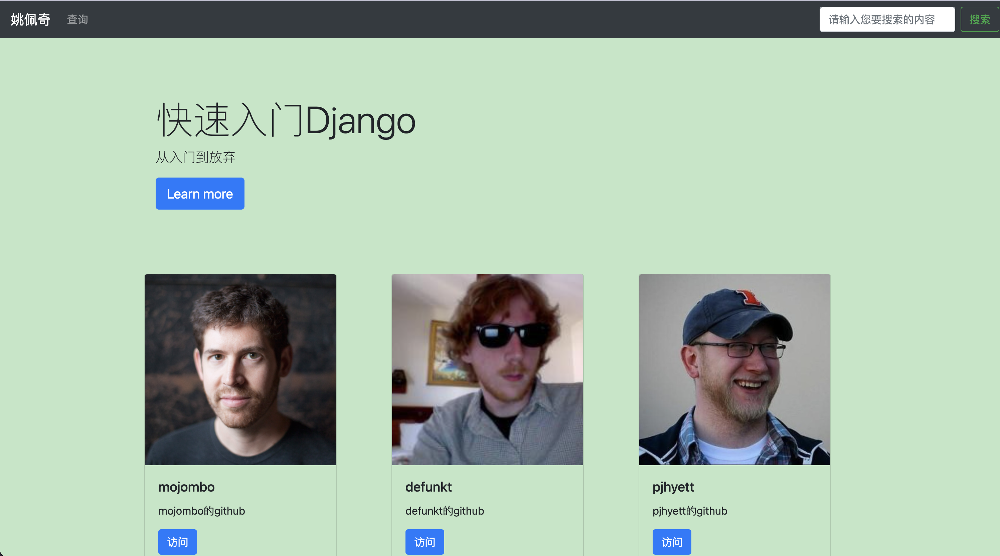

## Django 
- a simple server using python3. The index looks good.

## video
- [Bilibili study resources](https://www.bilibili.com/video/BV1KJ41117HL?p=15)
## settings
- interpreter
- package
## environment
```shell
# python3 --version
Python 3.9.6
# django-admin --version
4.1.3
```
## starter
```shell
# create project
django-admin startproject my_project_name
# start server
python3 manage.py runserver 127.0.0.1:8000
```
## attention
- Don't use path as route instead of use re_path.